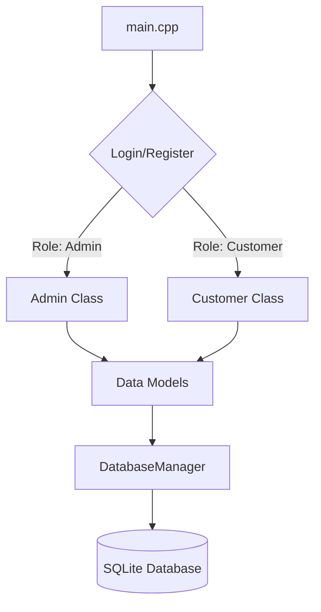

# Insurance Management System Documentation

## System Overview

The **Insurance Management System (IMS)** is a robust console-based application designed to manage insurance policies, handle customer onboarding (KYC), and process claims. The application is divided into a clear layered architecture.

The **Main Layer** (`main.cpp`) serves as the entry point of the application. It is responsible for:
1. **Bootstrapping**: Establishing a connection to the SQLite database and initializing the schema through the `DatabaseManager`.
2. **Authentication & Onboarding**: Handling user registration (including extensive KYC data collection for customers) and login loops.
3. **Delegation**: Upon a successful login, the system evaluates the user's role. It then instantiates the appropriate specialized class (`Admin` or `Customer`) and transfers control by calling their respective `displayMenu()` methods.

## Architecture Map

The system is built on a simple yet effective 3-tier architecture:

*   **Logic Layer (Business Logic)**: Handled by the `Admin` and `Customer` classes. These classes encapsulate the specific workflows, menus, and actions permissible for each user role. They contain no direct SQL code but instead communicate with the Persistence Layer.
*   **Data Layer (Models)**: Defined in `Models.h`. This layer consists of plain Old C++ Data Structures (PODs) like `User`, `Policy`, `UserPolicy`, and `Claim`. It also includes "View" structs (e.g., `PendingClaimView`, `UserClaimView`) tailored for specific data retrieval needs. These models act as the currency passed between the Logic and Persistence layers.
*   **Persistence Layer (DatabaseManager)**: Implemented as a Singleton class (`DatabaseManager`), this layer manages the SQLite database connection (`insurance_system.db`). It abstracts all raw SQL queries (using prepared statements for security) and provides a clean C++ API to the Logic Layer for CRUD operations.

## Class Reference

### `Admin`
*   **Primary Responsibility**: Encapsulates the workflow and functionalities available to administrative users.
*   **Key Member Functions**:
    *   `displayMenu()`: Shows the main admin dashboard and handles input.
    *   `addPolicy()`: Prompts for details to create a new insurance policy offering.
    *   `viewAllPolicies()`: Lists all insurance policies available in the system.
    *   `viewAllClaims()`: Displays a comprehensive list of all claims.
    *   `approveRejectClaim()`: Allows an admin to review pending claims, add remarks, and update their status.
    *   `exportApprovedClaims()`: Generates a CSV report (`approved_claims_report.csv`) of all approved claims.
*   **Database Interactions**: Reads from Policies, Claims, and Users tables. Writes to Policies and Claims tables via `DatabaseManager`.

### `Customer`
*   **Primary Responsibility**: Manages the interaction loop and operations for logged-in clients.
*   **Key Member Functions**:
    *   `displayMenu()`: Shows the customer dashboard.
    *   `viewAvailablePolicies()`: Lists policies that can be purchased.
    *   `purchasePolicy()`: Handles the workflow of buying a policy and calculating premiums/addons.
    *   `viewMyPolicies()`: Shows the active/past policies owned by the customer.
    *   `fileClaim()`: Allows the customer to submit a new claim against an active policy.
    *   `viewMyClaims()`: Displays the status of the customer's submitted claims.
    *   `showNotifications()`: Fetches and displays unread alerts regarding claim status updates.
*   **Database Interactions**: Reads from Policies, UserPolicies, and Claims. Writes to UserPolicies and Claims via `DatabaseManager`.

### `DatabaseManager`
*   **Primary Responsibility**: A thread-safe (singleton) interface for all SQLite interactions, ensuring prepared statements are used to prevent SQL injection.
*   **Key Member Functions**:
    *   `connect()`, `initializeSchema()`: Sets up the DB environment.
    *   `createUser()`, `getUserByUsername()`: User management.
    *   `createPolicy()`, `getAllPolicies()`: Policy management.
    *   `createClaim()`, `updateClaimStatus()`, `getPendingClaims()`: Claim lifecycle.
*   **Database Interactions**: Direct access to the SQLite file `insurance_system.db`. Manages tables like Users, Policies, UserPolicies, and Claims.

### `User` (Model)
*   **Primary Responsibility**: Data structure representing an individual user (Admin or Customer) within the system.
*   **Key Attributes**: `id`, `username`, `password`, `role`, `full_name`, KYC details (`age`, `gender`, `marital_status`, `nominee_name`, etc.), and `balance`.
*   **Database Interactions**: Maps directly to the `Users` table schema.

## Data Flow: Lifecycle of a Claim

The lifecycle of a claim spans across both the Customer and Admin workflows, seamlessly coordinated by the DatabaseManager:

1.  **Filing (Customer)**: The customer selects the `fileClaim()` option. They specify which active policy they are claiming against, the claim `amount`, and the `reason`.
2.  **Creation (Persistence)**: A `Claim` model is populated and passed to `DatabaseManager::createClaim()`. It is inserted into the `Claims` table with an initial status (typically 'Pending') and `is_notified` set to false (0).
3.  **Review (Admin)**: The admin navigates to `approveRejectClaim()`. The system calls `DatabaseManager::getPendingClaims()`, retrieving an aggregated view (`PendingClaimView`) of the user and claim details.
4.  **Adjudication (Admin)**: The admin inputs their decision ('Approved' or 'Rejected') along with `admin_remarks`.
5.  **Update (Persistence)**: The decision is sent to `DatabaseManager::updateClaimStatus()`, updating the specific row in the `Claims` table.
6.  **Notification (Customer)**: Upon their next login or by selecting `showNotifications()`, the customer receives an alert via `DatabaseManager::getUnnotifiedClaims()`. Once viewed, the claim is marked as notified (`DatabaseManager::markClaimNotified()`).

## Technical Specs

*   **Core Dependencies**: SQLite3 (`libsqlite3`) for the relational database.
*   **Language Standard**: C++17.
*   **Build Process**: The project uses a `Makefile` to streamline compilation.
    *   `make` or `make all`: Compiles `.cpp` files to object files (`.o`) and links them with the sqlite3 library (`-lsqlite3`) to create the `ims` executable.
    *   `make clean`: Removes all compiled binaries and object files.
*   **File Structure**:
    *   **Headers (`.h`)**: `Models.h`, `DatabaseManager.h`, `Admin.h`, `Customer.h`
    *   **Source (`.cpp`)**: `main.cpp`, `DatabaseManager.cpp`, `Admin.cpp`, `Customer.cpp`
    *   **Build Configuration**: `Makefile`
    *   **Data Stores**: `insurance_system.db` (SQLite DB), `approved_claims_report.csv` (Exported report)
    *   **Documentation**: `README.md`, `PROJECT_SPEC.md`, `DOCUMENTATION.md`
